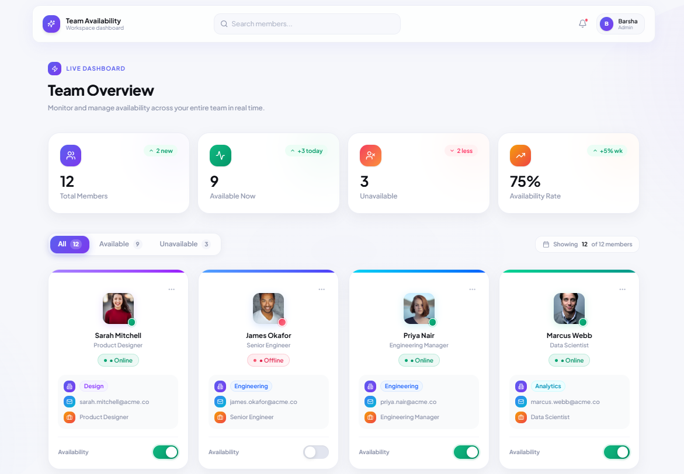

# 🚀 Team Availability Tracker

<p align="left">
  
</p>

A full-stack **Team Availability Tracker** built with **React, TypeScript, Flask, and SQLite**. The application allows users to monitor team availability, update member status through interactive toggles, and synchronize changes seamlessly between the frontend and backend database.

---

## 📌 Project Overview

The application provides a modern dashboard for managing team availability. Users can view all team members, search and filter them, and update their availability status. Every toggle action updates the SQLite database through a Flask REST API and immediately reflects on the frontend.

---

## ✨ Features

- 📋 Team member dashboard
- 🔍 Search team members
- 🎯 Filter by:
  - All
  - Available
  - Unavailable
- 🔄 Real-time availability toggle
- 💾 SQLite database integration
- ⚡ REST API with Flask
- 🎨 Modern responsive UI
- 📊 Dynamic dashboard statistics
- 🔔 Toast notifications after status updates

---

## 🛠 Tech Stack

### Frontend

- React
- TypeScript
- Vite
- Tailwind CSS
- Lucide React

### Backend

- Flask
- Flask-CORS
- Flask-SQLAlchemy

### Database

- SQLite

---

## 📂 Project Structure

```text
Team Availability Tracker/
│
├── backend/
│   ├── app.py
│   ├── config.py
│   ├── models.py
│   ├── seed.py
│   ├── requirements.txt
│   └── instance/
│
└── frontend/
    ├── src/
    │   ├── api/
    │   ├── app/
    │   └── styles/
    ├── package.json
    └── vite.config.ts
```

---

## ⚙️ Installation

### 1️⃣ Clone the repository

```bash
git clone https://github.com/Dbarsha-hub/Team-Availability-Tracker.git
```

```bash
cd Team-Availability-Tracker
```

---

## 🖥 Backend Setup

```bash
cd backend
```

Create a virtual environment

```bash
python -m venv venv
```

Activate it

### Windows

```bash
venv\Scripts\activate
```

### macOS/Linux

```bash
source venv/bin/activate
```

Install dependencies

```bash
pip install -r requirements.txt
```

Seed the database

```bash
python seed.py
```

Run the backend

```bash
python app.py
```

Backend runs on

```
http://127.0.0.1:5000
```

---

## 💻 Frontend Setup

Open another terminal

```bash
cd frontend
```

Install dependencies

```bash
npm install
```

Run the frontend

```bash
npm run dev
```

Frontend runs on

```
http://localhost:5173
```

---

## 🔗 API Endpoints

| Method | Endpoint          | Description                    |
| ------ | ----------------- | ------------------------------ |
| GET    | `/api/users`      | Fetch all team members         |
| PUT    | `/api/users/<id>` | Update a member's availability |

---

### Update availability

```
PUT /api/users/<id>
```

Example Request

```json
{
  "available": true
}
```

---

## 📸 Screenshots

## 📸 Dashboard Preview



## 📸 Dashboard Preview

<p align="center">
  
</p>
